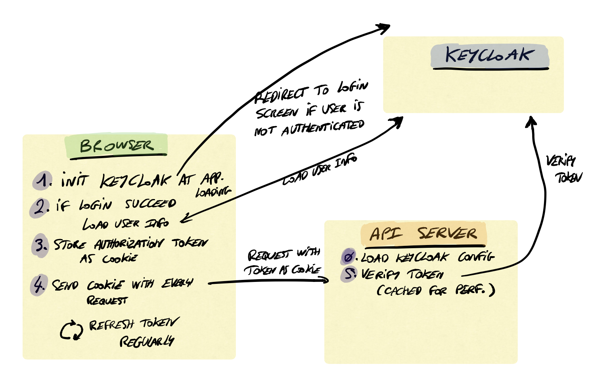

- [Introduction](#introduction)
  - [Specifics of the choosen Clojure server and ClojureScript client libs](https://github.com/jgrodziski/keycloak-clojure#specifics-of-the-choosen-clojure-server-and-clojurescript-client-libs)
  - [Principles of User Authentication](https://github.com/jgrodziski/keycloak-clojure#principles-of-user-authentication)
- [Principles of User Authentication - Keycloak Core Concepts](https://github.com/jgrodziski/keycloak-clojure#principles-of-user-authentication---keycloak-core-concepts)
- [Installing and Configuring Keycloak](https://github.com/jgrodziski/keycloak-clojure#installing-and-configuring-keycloak)
- [Web Frontend SPA authentication](https://github.com/jgrodziski/keycloak-clojure#web-frontend-spa-authentication)
  - [Lib Installation](https://github.com/jgrodziski/keycloak-clojure#lib-installation)
  - [Initial Authentication Steps](https://github.com/jgrodziski/keycloak-clojure#initial-authentication-steps)
  - [Token Storage](https://github.com/jgrodziski/keycloak-clojure#token-storage)
  - [Token refreshing](https://github.com/jgrodziski/keycloak-clojure#token-refreshing)
- [API Server Authentication](https://github.com/jgrodziski/keycloak-clojure#api-server-authentication)

# Introduction

**This article explains the integration of [Keycloak](http://www.keycloak.org), an Identity and Access Management Server in a [Clojure](https://www.clojure.org) ecosystem.**

Identify, authenticate and get the user roles are a must-have for every application, and also administrate the user's metadata. The typical application architecture is now a web and mobile frontend talking to a server API (in a REST or GraphQL manner). By the way, Keycloak entered the [Thoughtworks TechRadar in november 2017](https://www.thoughtworks.com/radar/platforms/keycloak) in the Trial category.

## Specifics of the choosen Clojure server and ClojureScript client libs

The main libraries used in the sample app are [Reagent](http://reagent-project.github.io/)/[Re-Frame](https://github.com/Day8/re-frame), React native and [Yada](https://github.com/juxt/yada) for the API backend.
I'll try to clearly separate the inner details of making Keycloak work and those of the surrounding libraries. You should easily adapt the environment as I'll try to explain the reason behind every mechanisms. 

The impacting server libs are: 
- [Yada](https://github.com/juxt/yada)
- [Mount](https://github.com/tolitius/mount)

The impacting client libs are:
- [re-frame](https://github.com/Day8/re-frame)
- [Mount](https://github.com/tolitius/mount) on the client side

# Principles of User Authentication - Keycloak Core Concepts

*Realm* is the core concept in Keycloak. A *realm* secures and manages security metadata for a set of users, applications and registered oauth clients. 

A *client* is a service that is secured by a *realm*. Once your *realm* is created, you can create a *client* i.e. a runtime component talking to keycloak: web frontend code in a browser, mobile frontend code in a React Native app, API server, etc. You will often use Client for every Application secured by Keycloak. When a user browses an application's web site, the application can redirect the user agent to the Keycloak Server and request a login. Once a user is logged in, they can visit any other client (application) managed by the realm and not have to re-enter credentials. This also hold true for logging out. *Roles* can also be defined at the *client* level and assigned to specific users. Depending on the *client* type, you may also be able to view and manage *user* *sessions* from the administration console.

*Adapters* are keycloak librairies in different technologies used for *client* to communicate with the keycloak servers. Luckily thanks to Clojure and Clojurescript running on hosted platform, respectively the JVM and the JS engine, we can use the [Keycloak Java Adapter](http://www.keycloak.org/docs/3.2/securing_apps/topics/oidc/java/java-adapters.html) and the [Keycloak Jsvascript Adapter](http://www.keycloak.org/docs/3.2/securing_apps/topics/oidc/javascript-adapter.html).

[OpenId Connect terminology](http://openid.net/specs/openid-connect-core-1_0.html#Terminology) is implemented by keycloak.

# Installing and Configuring Keycloak
You can use the [JBoss Keycloak docker image](https://hub.docker.com/r/jboss/keycloak/) `docker pull  jboss/keycloak-postgres:3.3.0.Final`
You'll need an SQL database for the storage, here I choose postgresql. There is a lot of documentation out there to configure Keycloak and postgresql, just google it. I put them behind a dockerized nginx proxy that manages quite easily the certificates renewing and proxying of docker container.
I use [nginx proxy](https://github.com/jwilder/nginx-proxy) with the [Letsencrypt nginx proxy companion](https://github.com/JrCs/docker-letsencrypt-nginx-proxy-companion) for the SSL support (SSL access is for me quite mandatory for keycloak...). It's quite easy to setup (just add some env variables to the docker container and that's it) and it works very well.

Now connect to your keycloak administration console and create:
- [a realm](http://www.keycloak.org/docs/latest/getting_started/index.html#_create-realm)
- [in that realm, a client](http://www.keycloak.org/docs/latest/getting_started/index.html#creating-and-registering-the-client)
- in that realm, [a test user](http://www.keycloak.org/docs/latest/getting_started/index.html#_create-new-user)

The client screen has an "installation" tab that allows to grab the credentials secret for this client that will be part of the needed configuration.

The following schema describes the steps and the interactions between the browser, the keycloak server and the API server:


# Web Frontend SPA authentication

## Lib installation
The keycloak javascript Adapter library is vanilla JS and does not implement the Google Closure contract, so the integration in the Leiningen cljsbuild should be in the form of a [foreign lib ](https://clojurescript.org/reference/packaging-foreign-deps) in your `project.clj`.

```clojure
  :cljsbuild
  {:builds
   [{:id           "dev"
     :source-paths ["src/cljs"]
     :figwheel     {:on-jsload "myapp.core/mount-root"}
     :compiler     {:main                 myapp.core
                    :output-to            "resources/public/js/compiled/app.js"
                    :output-dir           "resources/public/js/compiled/out"
                    :asset-path           "js/compiled/out"
                    :source-map-timestamp true
                    :preloads             [devtools.preload
                                           day8.re-frame.trace.preload
                                           re-frisk.preload]
                    :closure-defines      {"re_frame.trace.trace_enabled_QMARK_" true}
                    :external-config      {:devtools/config {:features-to-install :all}}
                    :externs ["lib/keycloak/keycloak-externs.js"]
                    :foreign-libs [{:file "lib/keycloak/keycloak.js"
                                    :provides ["keycloak"]}]
                    }}
```


## Initial Authentication Steps

The frontend needs to performs the following steps to authenticate the user:
1. Load the Keycloak client configuration
2. Create the javascript Keycloak object giving it the configuration, and call the "init" function.

  1. If the init is correct and the user is not authenticated, the Keycloak will redirect the browser to the Keycloak server login screen for her to be authenticated and then redirect back here properly authenticated.
  2. Else if the init is correct and at that point the user is authenticated, we provide a lambda that is called back calling the "loadUserInfo" function against the keycloak server 

Here are the code for each of those steps (in [security.cljs](https://github.com/jgrodziski/keycloak-clojure/blob/master/frontend/src/cljs/myapp/front/security.cljs)):

```clojure
;; We use mount equally on the client and server side, we define a security ns with a mount state inside

;; 1. The keycloak configuration stored in the project.clj file and "load" at compile time
(def config (emit-compile-time-conf))
(when config/debug?
  (info "myapp config loaded" config))

(defn- start-token-refresher []
  ;; event triggered every 30s to check for the keycloak token to be updated
  (interval/register-interval-handlers :myapp.events/token-to-update nil 30000)
  (re-frame/dispatch [:token-to-update/start]))

(defn init-and-authenticate
  [keycloak-config]
  (debug "load keycloak with config " keycloak-config)
  (let [js-keycloak-config (clj->js keycloak-config)
        ;; 2. Create the javascript Keycloak object giving it the configuration
        keycloak-obj (js/Keycloak js-keycloak-config)]
    (-> keycloak-obj
        ;; 3. If the init is correct and the user is not authenticated, the Keycloak will redirect the browser to the Keycloak server login screen for her to be authenticated and then redirect back a second time here properly authenticated.
        (.init #js {"onLoad" "login-required"
                    "checkLoginIframe" false})
        (.success (fn [authenticated]
                    (info "login succeeded?" authenticated)
                    ;; 4. Else if the init is correct and at that point the user is authenticated, we provide a lambda that is called back calling the "loadUserInfo" function against the keycloak server 
                    (when authenticated
                      (-> keycloak-obj
                          (.loadUserInfo)
                          (.success (fn [user-info]
                                      (when config/debug?
                                        (info "token is " (.-token keycloak-obj))
                                        (info "user-info:" (js->clj user-info)))
                                      ;; if we succeed to load the user info we dispatch a re-frame event to store the user info in DB
                                      ;; and store the token in a "X-Authorization-Token" cookie
                                      (re-frame/dispatch [:myapp.events/set-user-info
                                                          (merge {:token (.-token keycloak-obj)}
                                                                 (js->clj user-info :keywordize-keys true))])))))))
        (.error (fn [] (error "Failed to initialize Keycloak"))))
    ;; The token is short lived so we must refresh it regularly, here we start the refresher "background" process thanks to core.async
    (start-token-refresher)
    ;; Then we return the stateful Keycloak object that will represent the "state" of the security stuff in our app (see the defstate :start fn below)
    keycloak-obj))

(declare logout);; declare the logout symbol and bind it after as we must use the keycloak object to logout

(defstate keycloak ;; the value inside the state must be deferred using "@"
  :start (init-and-authenticate (:keycloak config))
  :stop (logout))

(defn logout [] ;; here the logout fn can be properly defined as the keycloak state is initialized
  (.logout @keycloak))

(defn check-to-update-token
  "re-frame compatible function that will check if a token refreshing is needed and do it consequently, dispatch an event with the refreshed token hereafter"
  [cofx event]
  (info "Check to update Keycloak Token" event)
  (-> @keycloak
      (.updateToken 180);refresh token every 180 seconds / 3mn
      (.success (fn [refreshed]
                  (info "token refreshed?" refreshed)
                  (when refreshed
                    ;;update the token in cookies and local storage
                    (re-frame/dispatch [:myapp.events/set-token-updated
                                        {:token (.-token @keycloak)}]))))
      (.error (fn [] (.logout @keycloak))))
  {:db (:db cofx)}) 
```

At that point the user is authenticated with a token and its info is loaded, the rest is traditionnal re-frame machinery to dispatch the event, update the DB and so on.

## Token Storage
Now that we get a token, we need to store it and be able to send it to the backend later on. We have different options for local storage, but mainly two for sending it to the backend: Cookie or HTTP Header. The Cookie option implies that we store it in the cookie store, with the header option we can do whatever we want.
Just be aware that the token is quite secured and is nevertheless short-lived, so in case the token is accessed by rogue hands it should not be a major worry, we can also do both. Have a look at the code in "[cookie.cljs](https://github.com/jgrodziski/keycloak-clojure/blob/master/frontend/src/cljs/myapp/front/cookie.cljs)"

## Token Refreshing
Now the token we get back from the initial authentication process needs to be refreshed regularly. To do that, we setup a "ticker" mechanism that triggers regularly the refresh check and performs it when needed. I won't enter into the details of re-frame event and effect handling, you'll get plenty of top-notch documentation from the re-frame repo for that. Just have a look at the code in "[interval.cljs](https://github.com/jgrodziski/keycloak-clojure/blob/master/frontend/src/cljs/myapp/front/interval.cljs)".


# Mobile frontend authentication
TODO

# API server authentication

The client is correctly configured and is sending either a cookie or a header containing a token with every request. The backend must:
1. Extract the token from the cookie or the header (Yada framework specific)
2. **Verify the token (Keycloak stuff)**
3. Ensure the client is accessing the restricted part only if the token is correct (Yada specific, for that part go read the excellent [Yada article "Speak friend and Enter!"](https://juxt.pro/blog/posts/yada-authentication.html))


The code is in [server.clj](https://github.com/jgrodziski/keycloak-clojure/blob/master/backend/src/myapp/backend/server.clj) calling some functions in [keycloak.clj](https://github.com/jgrodziski/keycloak-clojure/blob/master/backend/src/myapp/backend/keycloak.clj).

```clojure
;;1. Extract the token from the cookie or the header (Yada framework specific)
(defn authorization-token-cookie [ctx]
  (let [cookies (parse-cookies (:request ctx))]
    (get cookies "X-Authorization-Token")))

(defmethod yada.security/verify :keycloak
  [ctx scheme]
  (let [header-cred (authorization-bearer-cred ctx)
        cookie-cred (authorization-token-cookie ctx)]
    (-> (or header-cred cookie-cred)
        ;; Verify the token (Keycloak stuff)
        (keycloak/verify)
        (keycloak/extract))))

(defn- restricted-content [ctx]
  (html5
   [:body
    [:h1 (format "Hello %s!"
                 (get-in ctx [:authentication "default" :user]))]
    [:p "You're accessing a restricted resource!"]]))

(def routes
  ["/"
   [
    ["hello" ( handler (as-resource "Hello world!"))]
    ["restricted" (resource {:consumes #{"application/json"}
                             :produces {:media-type "text/html"}
                             :methods {:post (fn [ctx] (restricted-content ctx))}
                             ;;Ensure the client is accessing the restricted part only if the token is correct
                             :access-control {:scheme :keycloak
                                              :allow-origin "http://localhost:3449"
                                              :allow-credentials true
                                              :allow-methods #{:get :post :options}
                                              :allow-headers ["Content-Type"
                                                              "Access-Control-Allow-Headers"
                                                              "Authorization"
                                                              "X-Requested-With"
                                                              "X-Authorization-Token"]
                              :authorization {:methods {:get :employee :post :employee}}}})]
    [true (as-resource nil)]]])

(defstate server
  :start (listener routes {:port 8084})
  :stop ((:close server)))
```

Copyright (c) 2017 [Jeremie Grodziski](https://www.grodziski.com) - MIT License
